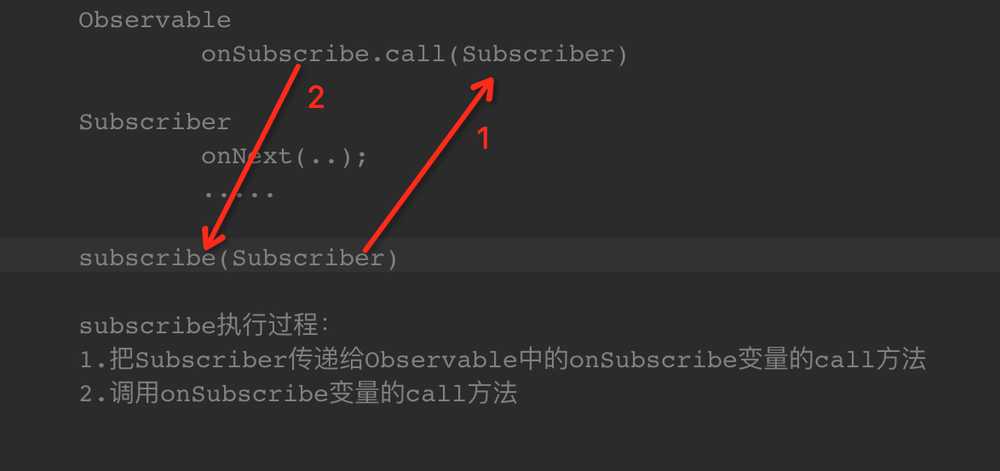
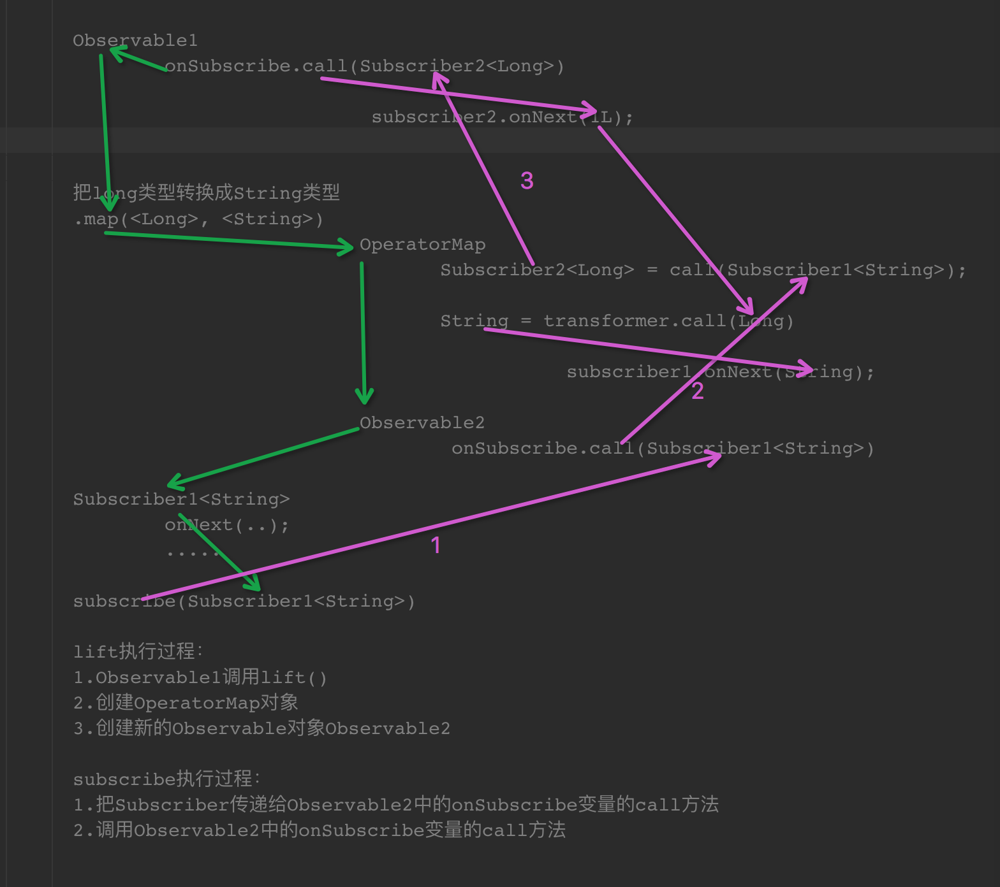

#RxJava源码解析：lift和subscribe流程
##1.subscribe流程
先看一个简单的例子：

	Observable.create(new Observable.OnSubscribe<Long>() {
            @Override
            public void call(Subscriber<? super Long> subscriber) {
                subscriber.onNext(1L);
                subscriber.onCompleted();
            }
        }).subscribe(new Subscriber<Long>() {
            @Override
            public void onCompleted() {
            }

            @Override
            public void onError(Throwable e) {

            }

            @Override
            public void onNext(Long s) {

            }
        });

subscribe的流程如下：

##2.lift流程
已map操作符为例：

	Observable.create(new Observable.OnSubscribe<Long>() {
            @Override
            public void call(Subscriber<? super Long> subscriber) {
                subscriber.onNext(1L);
                subscriber.onCompleted();
            }
        }).map(new Func1<Long, String>() {
            @Override
            public String call(Long aLong) {
                return aLong + "";
            }
        }).subscribe(new Subscriber<String>() {
            @Override
            public void onCompleted() {
            }

            @Override
            public void onError(Throwable e) {

            }

            @Override
            public void onNext(String s) {

            }
        });

lift过程：

1.	Observable1调用lift()。
2.	创建一个OperatorMap对象。
3.	把OperatorMap对象当做参数，传递给新创建的Observable2对象。

lift过程执行完毕	
lift过后的subscribe过程：

1.	把`Subscriber<String>`传递给Observable2的OnSubscribe方法
2.	调用Observable2的OnSubscribe的call方法

Observable2的OnSubscribe的call方法做的操作	

1.	调用OperatorMap对象call方法，生成一个新的`Subscriber<Long>`
2.	把`Subscriber<Long>`传递给Observable1的OnSubscribe的call方法
3.	调用OnSubscribe的call方法，call方法调用`Subscriber<Long>`的onNext(1L);
4.	`Subscriber<Long>`的onNext(1L)调用了
	
		(new Func1<Long, String>() {
            @Override
            public String call(Long aLong) {
                return aLong + "";
            }
        }
方法把Long类型转换成String类型，然后调用`Subscriber<String>`的onNext()方法。	
到此结束

