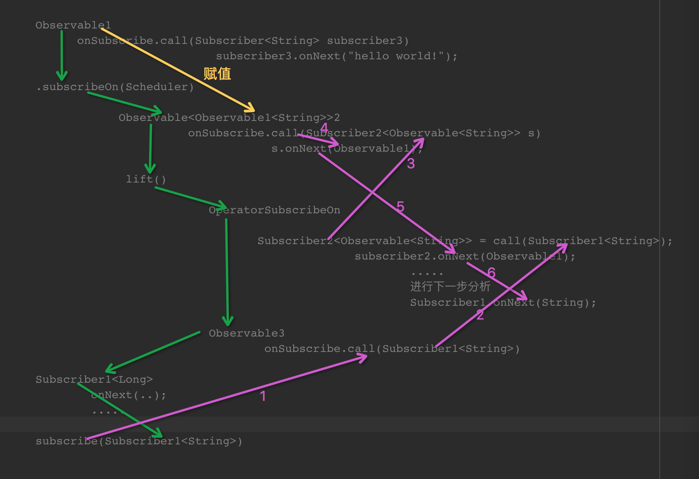
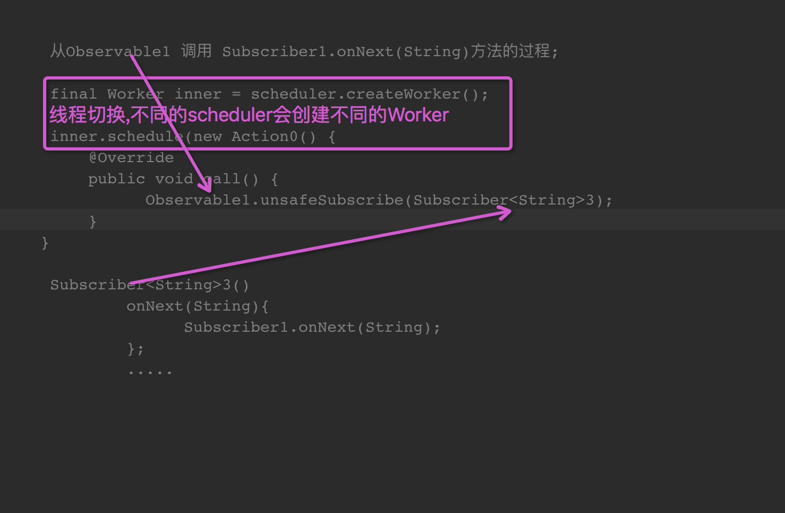

#RxJava源码解析：操作符subscribeOn
##1.subscribe流程
先看一个简单的例子：

	//标记为Observable1
	Observable.create(new Observable.OnSubscribe<String>() {
            @Override
            public void call(Subscriber<? super String> subscriber) {
                subscriber.onNext("hello world!");
                subscriber.onCompleted();
            }
        })
        .subscribeOn(Schedulers.newThread())
        
        //Subscriber标记为Subscriber1
        .subscribe(new Subscriber<String>() {
            @Override
            public void onCompleted() {
            }

            @Override
            public void onError(Throwable e) {

            }

            @Override
            public void onNext(String s) {

            }
        });

subscribeOn的流程如下：

1.	首先会根据原来的Observable1生成一个新的`Observable<Observable<String>>`我们命名为Observable2
2.	然后调用Observable2.lift(OperatorSubscribeOn);
3.	返回调用lift之后生成的新的Observable3.
subscribeOn过程执行完毕

subscribe()过程跟之前分析的的一样。
注意：

1.	`Observable<Observable<String>>2`中onSubscribe中的call()方法，返回的是Observable1
2.	OperatorSubscribeOn中生成的Subscriber2对象负责把`Observable<Observable<String>>2`发射的Observable1跟Subsriber1关联调用

现在分析OperatorSubscribeOn生成的Subscriber2

1.	Subscriber2中调用scheduler创建不同的调度器的worker
2. worker调用schedule()去执行Observable1的subscribe()
3.  Observable1的subscribe()方法中的`Subscriber<String>`调用了`Subscriber1<String>`中的onNext() onCompleted()等。

完毕

